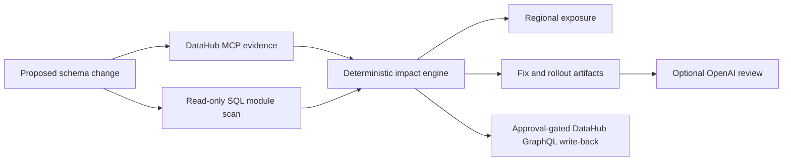

# ChangeProof

**Know what breaks before you ship a data contract change.**

ChangeProof turns DataHub metadata into an enterprise migration decision. It traces a proposed schema edit, discovers hidden SQL consumers, maps regional exposure, generates reviewable fixes, and drafts the decision back into DataHub behind human approval.

[Existing public deployment](https://changeproof-production.up.railway.app/) · [Repository](https://github.com/rishvaiyer/ChangeProof) · [Apache-2.0 license](LICENSE)

> The AsterVale Enterprise Impact Center is implemented on the feature branch and must be deployed before the public URL reflects this README. Hosted mode uses deterministic synthetic metadata. The repository also includes an opt-in integration verified against a local DataHub instance.

## Judge flow

Use the prepared AsterVale Living scenario:

```text
Column:        customer_id
Current type: varchar
Proposed type: bigint
```

Then visit six focused workspaces:

1. **Analyze:** frame the proposed contract change and see the enterprise summary.
2. **Impact graph:** combine DataHub lineage with hidden SQL Server module findings.
3. **Regions:** map affected assets, stored procedures, owners, and review flags across Northeast, South, Midwest, West, and unknown metadata.
4. **Fix Studio:** review generated SQL, validation queries, rollback controls, JSON, and SARIF artifacts.
5. **Rollout:** follow a dependency-ordered migration with explicit gates.
6. **DataHub actions:** approve individual incident, tag, and documentation drafts.

## Enterprise scenario

AsterVale Living is a fictional national home-furnishings retailer with 420 stores and six regional distribution centers. All company, customer, procedure, and regional data is synthetic.

The proposed edit is:

```text
stg_orders.customer_id: varchar -> bigint
```

DataHub evidence exposes this downstream chain:

```text
stg_orders.customer_id
  -> fct_order_sales
  -> loyalty_customer_value [critical]
  -> regional_returns
  -> executive_revenue_dashboard [critical]
```

ChangeProof also searches SQL Server module definitions and finds four code-level consumers, including `CONVERT`, `CAST`, join logic, and dynamic SQL. Recognized convert and cast expressions receive reviewable drafts. Joins and dynamic SQL are marked for manual review unless a semantic rewrite can be verified.

## What DataHub contributes

DataHub is the operational evidence graph, not a normal application database:

- Column-level lineage and hop distance
- Dataset and schema-field identity
- Ownership metadata
- Critical-asset tags
- Metadata completeness and freshness
- Business grouping that can be represented with domains
- Regional context that can be represented with structured properties
- Official MCP tool contracts for schema and lineage reads
- GraphQL write-back for incidents, tags, and documentation

ChangeProof adds the decision layer for a change that has not happened yet:

- Change-specific evidence scoring
- Hidden SQL dependency discovery
- Geographic blast-radius aggregation
- Generated migration and validation artifacts
- Dependency-ordered rollout and rollback
- Explicit AI second-pass review
- Human-approved DataHub write-back

## Architecture



Core design boundaries:

- Hosted mode executes no database SQL.
- Generated SQL never executes automatically.
- AI runs only after the user clicks **Run AI review**.
- AI is advisory only. It cannot change risk scores, deterministic evidence, execution, or write-back.
- Backtick-delimited identifiers are checked against the evidence bundle, but free-form AI prose is never treated as authoritative discovery.
- Approval requests carry proposal IDs only. Catalog content is rebuilt server-side.
- Missing lineage, ownership, or region metadata stays visible as uncertainty.

## Generated artifacts

The Fix Studio downloads six deterministic outputs:

- `impact-report.json`
- `discovery-query.sql`
- `proposed-fixes.sql`
- `validation-queries.sql`
- `rollback.sql`
- `changeproof.sarif`

## Run locally

Requires Python 3.12.

```bash
uv sync --extra dev
CHANGE_PROOF_WRITEBACK_MODE=simulated uv run uvicorn changeproof.app:app --reload
```

Open [http://localhost:8000](http://localhost:8000).

For the optional AI review:

```bash
export OPENAI_API_KEY="your-key"
```

The key alone makes no API request. A request occurs only after an explicit click.

## Live DataHub path

```bash
make live-demo
```

The current live integration:

- Builds the synthetic SonicLedger dbt and DuckDB fixture
- Emits schemas, owners, tags, table lineage, and fine-grained column lineage
- Reads schema and lineage through the official DataHub MCP server
- Uses the same deterministic impact and remediation engine
- Applies approved write-back proposals through DataHub GraphQL

Real GraphQL mutation mode is disabled by default. `make live-demo` enables it only for the trusted loopback runtime after the local DataHub checks pass.

The AsterVale regional properties are bundled synthetic evidence in hosted mode. They model the domains and structured properties an enterprise deployment would ingest. They are not presented as live DataHub Cloud data.

## Verify

```bash
uv run pytest -q
uv run ruff check .
```

The ordinary suite is credential-free. Live DataHub remains opt-in:

```bash
CHANGE_PROOF_LIVE_DATAHUB=1 uv run pytest tests/integration/test_datahub_context.py -q
```

## Current boundaries

- The existing public deployment must be updated before it shows AsterVale.
- Hosted evidence is deterministic and synthetic, not a live DataHub Cloud connection.
- Hosted write-back is simulated and clearly labeled. It makes no network call.
- The local live path is the verified DataHub MCP and GraphQL integration.
- Static SQL discovery cannot guarantee complete dependency coverage.
- Dynamic SQL and absent region metadata require manual review.
- Regional flags are coordination signals, not legal-compliance determinations.

## License

ChangeProof is available under the [Apache License 2.0](LICENSE).
