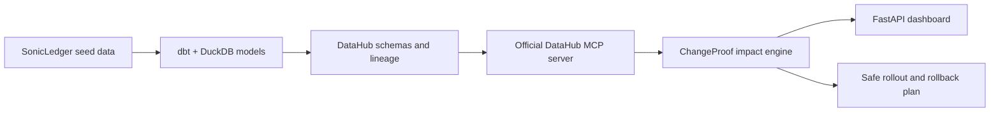

# ChangeProof

**Know what breaks before you ship a data contract change.**

ChangeProof uses DataHub metadata to trace the observed downstream impact of a proposed schema change, score the evidence, and generate a staged remediation and rollback plan.

[Live demo](https://changeproof-production.up.railway.app/) · [Draft implementation PR](https://github.com/rishvaiyer/ChangeProof/pull/1) · [MIT license](LICENSE)

> The public Railway demo uses bundled SonicLedger metadata for reliability. The repository also includes an opt-in local integration path verified against live DataHub MCP lineage.

## The three-minute judge flow

1. **Propose a change.** Change `stg_streams.artist_id` from `varchar` to `bigint`.
2. **Trace the blast radius.** ChangeProof follows column-level lineage, ownership, critical tags, and hop distance through DataHub.
3. **Ship a safer plan.** The engine recommends a parallel typed field, staged downstream migration, validation gates, and explicit rollback steps.

Try the prepared scenario in the [live dashboard](https://changeproof-production.up.railway.app/):

```text
Column:        artist_id
Current type: varchar
Proposed type: bigint
```

## Why this matters

A one-line schema edit can quietly become a payout incident.

In the SonicLedger demo, `artist_id` flows through the royalty pipeline:

```text
stg_streams.artist_id
  -> fct_royalties
  -> artist_payouts [critical]
  -> finance_royalty_dashboard [critical]
```

Changing the field in place can break royalty calculations, artist payouts, and finance reporting. ChangeProof does not pretend to know hidden consumers. It reasons over the graph DataHub actually observed and lowers confidence when that evidence is incomplete.

## How it works



ChangeProof keeps three responsibilities separate:

1. **Evidence collection** reads schema fields and bounded downstream lineage through the official DataHub MCP server.
2. **Impact assessment** scores the freshness and completeness of observed metadata, identifies critical assets, and gathers required reviewers.
3. **Remediation planning** turns the change shape and observed impact into ordered rollout, validation, and rollback actions.

## DataHub integration depth

The project consumes DataHub as an operational decision graph, not just a catalog screen:

- Column-level downstream lineage
- Dataset and schema-field identity
- Ownership metadata
- Critical-asset tags
- Lineage degree, bounded to three hops
- Schema-field presence and metadata completeness
- Official DataHub MCP tool contracts for schema and lineage reads

The local fixture seeds a real dbt lineage chain into DataHub, including fine-grained `artist_id` propagation. ChangeProof then asks DataHub which observed consumers are exposed before recommending a rollout.

## Example decision

| Signal | Demo result |
| --- | --- |
| Confidence | `HIGH` |
| Blast radius | 3 downstream assets |
| Maximum depth | 3 hops |
| Critical assets | 2 |
| Strategy | `parallel_typed_field` |

The recommended plan keeps the original field available while a parallel `bigint` field is backfilled and validated. Downstream assets migrate in lineage order. The original contract remains the rollback path until owners confirm the cutover.

## Two honest demo modes

### Hosted demo

- Public at [changeproof-production.up.railway.app](https://changeproof-production.up.railway.app/)
- Uses bundled SonicLedger metadata
- Deterministic and credential-free
- Designed as a reliable judge and recruiter walkthrough

### Local live-DataHub demo

- Builds seeded test data and dbt models in DuckDB
- Emits schemas, ownership, tags, table lineage, and fine-grained lineage to DataHub
- Reads the resulting graph through the official DataHub MCP server
- Runs the same impact and remediation engine used by the dashboard

The hosted demo is not presented as a live DataHub connection. That distinction is intentional.

## Run it locally

The application uses Python 3.12.

```bash
uv sync --extra dev
make demo-baseline
uv run uvicorn changeproof.app:app --reload
```

Open [http://localhost:8000](http://localhost:8000).

### Run the live DataHub path

Docker Desktop should have enough memory available for DataHub Quickstart. The repository invokes the DataHub CLI through Python 3.11 for quickstart compatibility while the ChangeProof application remains on Python 3.12.

```bash
make datahub-up
make datahub-seed
CHANGE_PROOF_LIVE_DATAHUB=1 uv run pytest tests/integration/test_datahub_context.py -q
make datahub-down
```

The live test is opt-in so ordinary test runs do not require Docker or a running DataHub instance.

## Verify the project

```bash
uv run pytest -q
```

Current verified result: **34 passed, 1 opt-in live test skipped**.

The public deployment also exposes:

- `GET /` for the dashboard
- `POST /analyze` for the prepared schema-change analysis
- `GET /healthz` for Railway health verification

## Project structure

```text
src/changeproof/    classifier, MCP adapter, impact scorer, planner, and web app
demo/sonicledger/   dbt models, DuckDB profile, seed data, and data tests
scripts/            DataHub lifecycle checks and metadata seeding
tests/              unit, dbt integration, web, and opt-in live DataHub tests
```

## Current boundaries

- Railway uses bundled metadata and is not connected to a hosted DataHub instance.
- The public form demonstrates the prepared `artist_id` type-change scenario.
- Remediation is deterministic; AI-generated review is not enabled yet.
- Dynamic SQL and unobserved external consumers require explicit human review.

These boundaries are visible because ChangeProof is meant to support data-engineering decisions, not manufacture confidence the metadata cannot justify.

## Roadmap

- Stored-procedure parameter, result-set, and dependency-change analysis
- Bounded AI review that explains deterministic evidence without inventing dependencies
- Hosted DataHub or DataHub Cloud connectivity for the public demo
- Draft-and-approve DataHub write-backs for proposed change plans

## License

ChangeProof is available under the [MIT License](LICENSE).
