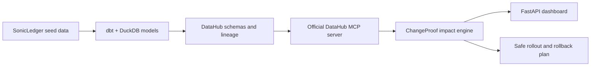

# Hackathon README Implementation Plan

> **For agentic workers:** REQUIRED SUB-SKILL: Use superpowers:subagent-driven-development (recommended) or superpowers:executing-plans to implement this plan task-by-task. Steps use checkbox (`- [ ]`) syntax for tracking.

**Goal:** Replace the minimal README with an outcome-first, evidence-backed project page for DataHub hackathon judges.

**Architecture:** The README will lead with the live product and judge flow, then explain the SonicLedger incident, DataHub integration, architecture, demo modes, and reproducible setup. It will remain a single `README.md` with one Mermaid system diagram and no generated badges or external image dependencies.

**Tech Stack:** GitHub Markdown, Mermaid, Python 3.12, dbt, DuckDB, DataHub, MCP, FastAPI, Railway

## Global Constraints

- Lead with outcomes and proof, not installation instructions.
- Link directly to `https://changeproof-production.up.railway.app/`.
- Do not claim that Railway is connected to live DataHub.
- Describe Railway as bundled SonicLedger metadata and local mode as live DataHub MCP.
- Avoid fake badges, invented benchmarks, and unverified claims.
- Preserve the Python 3.12 application and Python 3.11 DataHub quickstart boundary.
- Keep commands copyable and verified against `Makefile` and `pyproject.toml`.

---

### Task 1: Judge-Facing Project README

**Files:**
- Modify: `README.md`

**Interfaces:**
- Consumes: the public Railway URL, existing Make targets, source architecture, and verified test counts.
- Produces: the public repository landing page used by judges and recruiters.

- [ ] **Step 1: Replace the opening with the product outcome and judge links**

Use this exact opening structure:

```markdown
# ChangeProof

**Know what breaks before you ship a data contract change.**

ChangeProof uses DataHub metadata to trace the observed downstream impact of a proposed schema change, score the evidence, and generate a staged remediation and rollback plan.

[Live demo](https://changeproof-production.up.railway.app/) · [Draft implementation PR](https://github.com/rishvaiyer/context-is-key/pull/1)

> The public Railway demo uses bundled SonicLedger metadata for reliability. The repository also includes an opt-in local integration path verified against live DataHub MCP lineage.
```

- [ ] **Step 2: Add the judge flow and SonicLedger incident**

Explain the flow in three numbered steps: propose `artist_id` from `varchar` to `bigint`, trace the observed downstream graph, and receive a safe `parallel_typed_field` rollout. Show this exact compact lineage:

```text
stg_streams.artist_id
  -> fct_royalties
  -> artist_payouts [critical]
  -> finance_royalty_dashboard [critical]
```

State that a careless change can affect royalty calculations, artist payouts, and finance reporting. Do not claim hidden consumers are known.

- [ ] **Step 3: Add the architecture and DataHub depth sections**

Use this Mermaid diagram:



Describe the exact DataHub evidence consumed: column-level downstream lineage, ownership, critical tags, hop distance bounded to three, schema-field presence, and metadata completeness. Explain that the engine separates evidence collection, impact assessment, and remediation planning.

- [ ] **Step 4: Add example output and demo-mode truth**

Include a compact output table with these verified values:

| Signal | Demo result |
| --- | --- |
| Confidence | `HIGH` |
| Blast radius | 3 downstream assets |
| Maximum depth | 3 hops |
| Critical assets | 2 |
| Strategy | `parallel_typed_field` |

Then distinguish:

- Hosted mode: public, deterministic, bundled SonicLedger metadata, no secrets required.
- Local live mode: dbt and DuckDB test data, seeded DataHub metadata, and official DataHub MCP lineage reads.

- [ ] **Step 5: Add reproducible setup and verification commands**

Document these exact commands:

```bash
uv sync --extra dev
make demo-baseline
uv run uvicorn changeproof.app:app --reload
```

For live DataHub:

```bash
make datahub-up
make datahub-seed
CHANGE_PROOF_LIVE_DATAHUB=1 uv run pytest tests/integration/test_datahub_context.py -q
make datahub-down
```

Explain that the application uses Python 3.12 while the quickstart scripts invoke the DataHub CLI through Python 3.11 compatibility commands. Include `uv run pytest -q` as the normal test command.

- [ ] **Step 6: Add focused project structure, limitations, and roadmap**

Describe these directories only:

- `src/changeproof/`: classifier, DataHub MCP adapter, impact scorer, remediation planner, and web app.
- `demo/sonicledger/`: dbt models, DuckDB profile, seed data, and tests.
- `scripts/`: DataHub lifecycle and metadata seeding.
- `tests/`: unit, dbt integration, web, and opt-in live DataHub tests.

State current limitations plainly: hosted mode is not connected to DataHub, the public form demonstrates the prepared `artist_id` type change, and AI-generated review is not enabled. List stored-procedure diff analysis, bounded AI review, and hosted DataHub connectivity as roadmap items.

- [ ] **Step 7: Validate the README and repository**

Run:

```bash
rg -n '^#|^```|changeproof-production|DataHub MCP|parallel_typed_field' README.md
curl -fsS https://changeproof-production.up.railway.app/healthz
uv run pytest -q
git diff --check
```

Expected: headings and code fences are present, the live health endpoint returns `{"status":"ok","service":"changeproof"}`, tests report zero failures, and Git reports no whitespace errors.

- [ ] **Step 8: Commit and publish the README update**

```bash
git add README.md
git commit -m "docs: publish hackathon-ready README"
git push origin codex/changeproof-implementation
```

Verify that pull request 1 remains open and now includes the README commit:

```bash
gh pr view 1 --repo rishvaiyer/ChangeProof --json url,state,isDraft,commits
```
