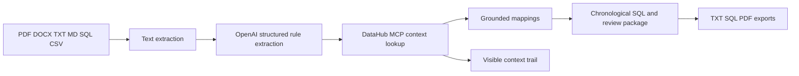

# Document Context Bridge Design

## Goal

Let an investigator upload an SRS or incident document in the Triage Composer and turn it into a grounded, reviewable investigation package. The demo should make the relationship between document requirements, DataHub context, and generated SQL visible.

## User experience

The Triage Composer will support two equivalent inputs:

1. Paste requirements into the existing textarea.
2. Choose a local document file from the browser.

Supported document formats are PDF, DOCX, TXT, Markdown, SQL, and CSV. The browser submits the extracted text only; the original file is not persisted. The UI will show a small document receipt with filename, format, extracted character count, and a clear privacy boundary.

After submission, the page will show:

- extracted requirements and unmapped lines;
- rule-to-asset and rule-to-column mappings;
- a chronological DataHub context trail;
- cross-domain query flow and generated SQL;
- confidence, missing context, and human-review warnings;
- TXT, SQL, and PDF exports.

## Context and AI boundary

OpenAI is an advisory interpreter. It may extract requirements and explain grounded results, but it may not create an asset, column, owner, lineage edge, or execution result.

DataHub MCP is the context authority when live configuration is available. The live path will use bounded searches, schema reads, and lineage reads and record each operation for display. Returned metadata is the only source allowed to confirm mappings. If live MCP is unavailable, the existing bundled synthetic catalog remains an explicit fallback so the Railway demo stays deterministic and usable.

## Architecture

The extraction layer is format-specific and returns one normalized `DocumentText` value. Triage remains responsible for bounded rule parsing and query composition. A context provider boundary allows live DataHub MCP and the bundled catalog to share the same mapping result shape. The existing advisory AI review remains separate from deterministic evidence.

## Limits and failure handling

- Preserve the existing 20,000-character and 20-rule limits after extraction.
- Reject unsupported extensions, empty documents, encrypted/unreadable documents, and oversized uploads with a plain-language error.
- If AI is unavailable, continue with deterministic mapping of extracted text.
- If live DataHub MCP is unavailable, label the result as bundled synthetic context rather than implying live retrieval.
- Never execute generated SQL.
- Never persist uploaded document contents or send the original binary to OpenAI; only extracted text and bounded context are sent when the user invokes AI functionality.

## Verification

- Unit tests for TXT/Markdown/SQL/CSV, PDF, DOCX, unsupported files, empty files, and extraction limits.
- Integration tests for multipart upload, document receipt, grounded mapping, visible DataHub steps, errors, and all exports.
- Existing full test suite and Ruff checks remain green.
- Live browser check confirms the hosted route remains usable with the bundled fallback and that the new upload affordance is readable.

## Non-goals

- Persistent document storage or cross-user memory.
- Autonomous write-back to DataHub or source databases.
- Treating AI output as evidence.
- Requiring Docker or a local DataHub instance for the hosted demo.
